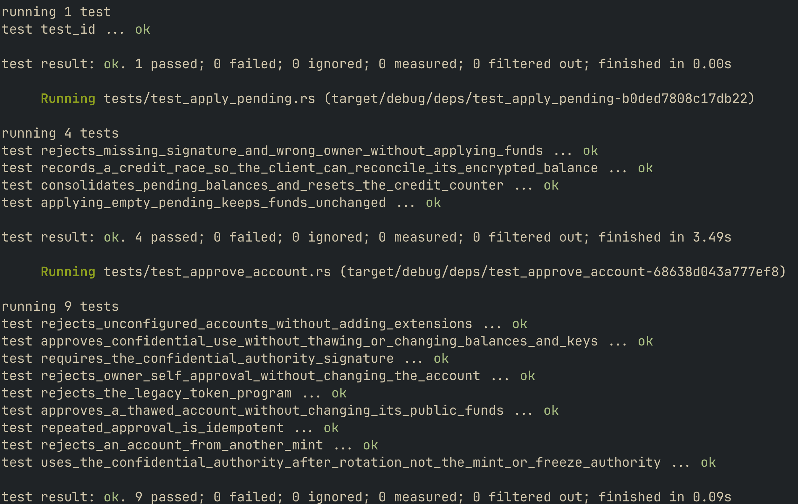
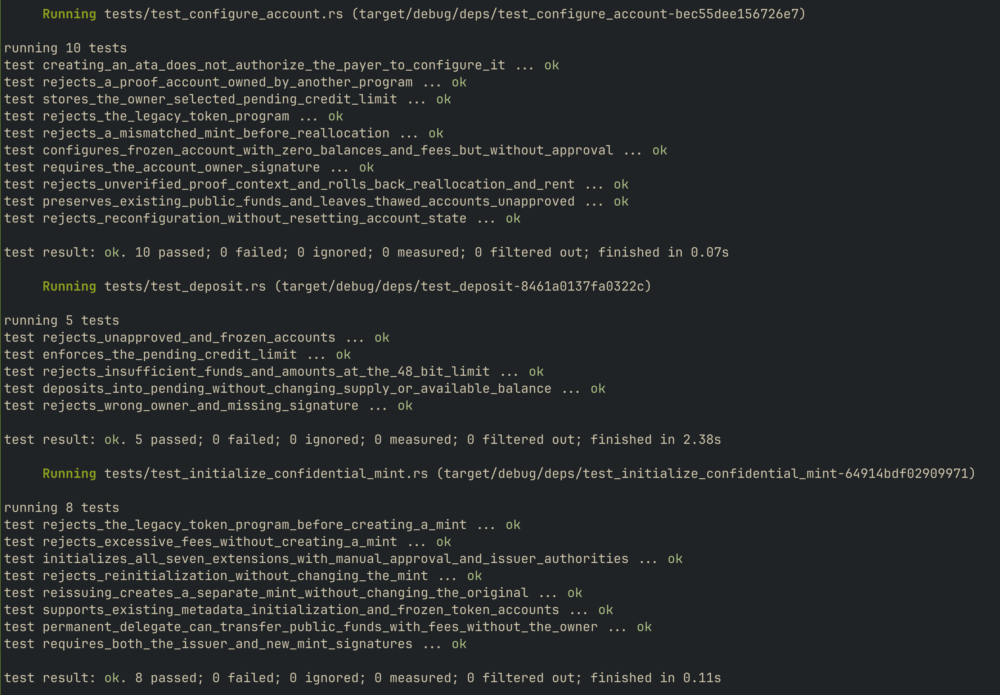
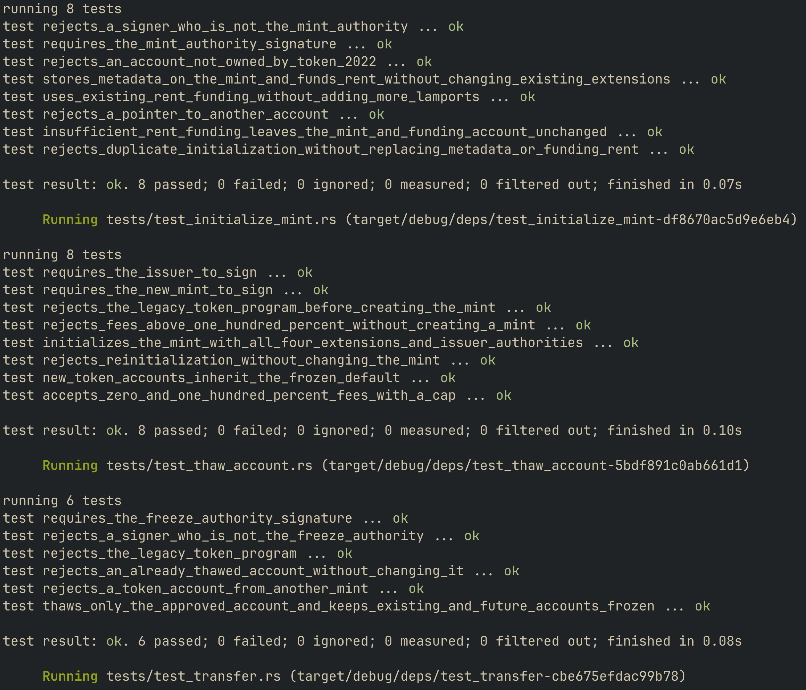
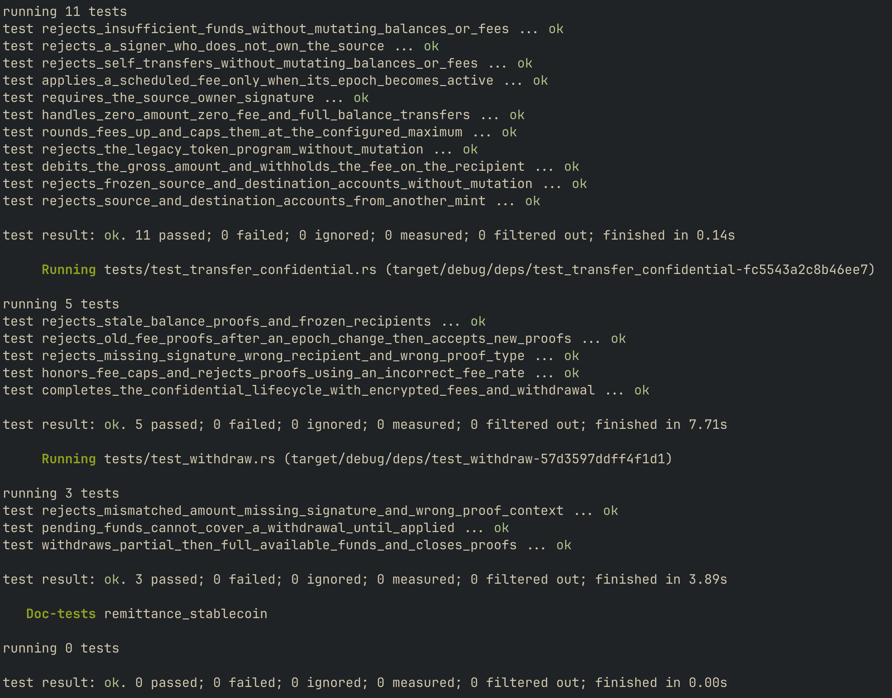

# Remittance stablecoin

An Anchor program for a Token-2022 remittance token with fees, KYC-controlled accounts, and on-chain metadata. A second mint adds confidential transfers and permanent delegation.

## Instructions

| Instruction | Who signs | What it does |
| --- | --- | --- |
| `initialize_mint` | Payer, new mint, issuer | Creates a mint with transfer fees, a metadata pointer, frozen defaults, and a close authority. |
| `initialize_metadata` | Payer, mint authority | Stores the name, symbol, and URI on the mint. |
| `thaw_account` | Freeze authority | Thaws one account after KYC. |
| `transfer` | Account owner | Transfers public tokens using the current epoch's fee. |
| `initialize_confidential_mint` | Payer, new mint, issuer | Creates a new mint with the same extensions plus confidentiality, encrypted fees, and permanent delegation. |
| `configure_account` | Payer, account owner | Adds confidential balances to an existing token account using a verified public-key proof. |
| `approve_account` | Confidential-transfer authority | Approves a configured account for confidential use. |
| `deposit` | Account owner | Moves public tokens into confidential pending balance. |
| `apply_pending` | Account owner | Moves pending funds into available balance. |
| `transfer_confidential` | Sender | Transfers confidential funds with encrypted fee withholding. |
| `withdraw` | Account owner | Moves available confidential funds back into public balance. |

Public amounts use the mint's smallest units. With six decimals, `1_000_000` is one token. Fees use basis points: `100` means 1%.

## How it works

New accounts start frozen. Thawing leaves the mint's default unchanged. Anyone can create an ATA; confidential configuration requires its owner. Issuer approval and thawing are separate.

The confidential flow is:

```text
Create account → Configure → Approve and thaw → Deposit → Apply pending
→ Confidential transfer → Recipient applies pending → Withdraw
```

Public transfers use `transfer_checked_with_fee` with the current epoch's fee. Confidential transfers use five proof contexts. Keys and proof generation stay off-chain.

## Build and test

Install Rust 1.97.1, the Solana CLI with SBF build tools, and Anchor CLI 1.1.2. Run from the repository root:

```sh
anchor test --skip-deploy --skip-local-validator
```

Tests run locally with LiteSVM 0.16. No deployment or local validator is needed.

The 77 integration tests cover authorities, frozen defaults, fee caps, epoch changes, proof validation, and the complete confidential lifecycle, including balance conservation and proof-account cleanup.

## Test results

All 77 integration tests and the program-ID test pass, with zero failures.

<details>
<summary>View test screenshots</summary>









</details>

## Written finding

If a user moves tokens into confidential balances before the permanent delegate acts, the delegate cannot transfer or burn those confidential funds through its ordinary authority. It can act on public balances only. Manual approval controls entry into the confidential system; it does not grant seizure authority over funds already inside it.

These extensions therefore do not guarantee seizure of every balance. See the [Token-2022 permanent delegate documentation](https://www.solana-program.com/docs/token-2022/extensions#permanent-delegate).

## Scope

This is an educational implementation. KYC is simulated through authority signatures. It does not implement fiat reserves, redemption, or the optional CPI Guard challenge.

Mint close authority is configured, but mint closure is not yet covered by an integration test. Public-balance seizure is tested through Token-2022 directly.
